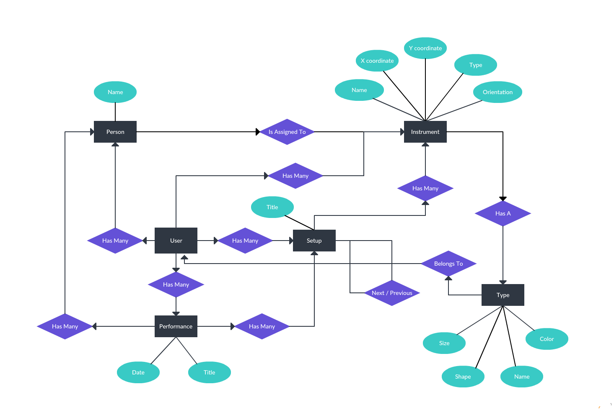

# Transitions API

This is the API for my planned transitions web application.

## Entity-Relationship Diagram



## Contributing

To contribute to this project, please follow the following steps:

1. [Fork](https://help.github.com/articles/fork-a-repo) this repository on the
   GitHub website, then clone your repository onto your computer:

    ```
    $ git clone git@github.com:[Your GitHub Account]/Kamaete-API.git
    ```

1. Go into the `Kamaete-API` directory

    ```
    $ cd Kamaete-API
    ```

1. Keep track of any changes made to the original repository by adding a
   remote named upstream:

    ```
    git remote add upstream https://github.com/jgraycar/Kamaete-API.git
    ```

   To sync any changes made with your own repository, run the commands

    ```bash
    git fetch upstream
    git merge upstream/master
    ```

   and fix any merge conflicts that arise.

1. Run the setup script and follow the prompts to install all required
   dependencies

    ```
    $ bin/setup
    ```

   This will also create the development database and (once I write a seed
   file later) seed it with preset resources.
